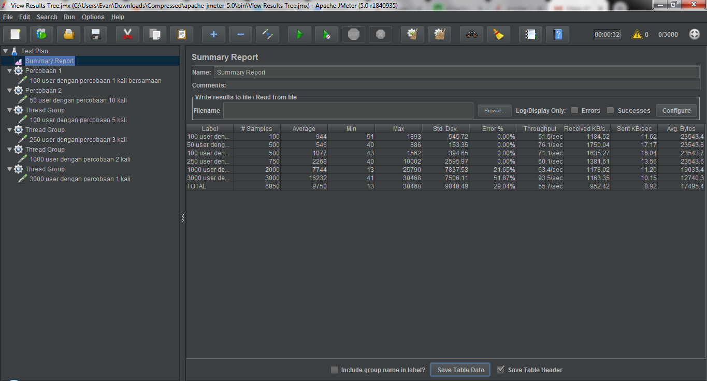

# Basis Data Terdistribusi
##### Muhammad Firza Gustama - 05111540000170
-----------------------------------------
### 1. Arsitektur Sistem
|No|Nama|Sistem|Node|RAM|
|---|---|---|---|---|
|1|Host|Ubuntu 16.04|1 Node|4GB|
|2|VM MySQL Proxy| Ubuntu 16.04|1 Node|512MB|
|3|VM MySQL Cluster| Ubuntu 16.04|3 Node|256MB|
|4|VM Redis Cluster|Ubuntu 16.04|3 Node|512MB|
|5|Aplikasi| Laravel 5.6| - | - |
|6|API|Ubuntu 16.04|-|-|


---
### 2. MySQL Cluster
Setelah **_vagrant up_**, ssh ke proxy lalu
```sh
$ mysql -u admin -padmin -h 127.0.0.1 -P 6032 < /vagrant/mysql/proxysql.sql
```
---
### 3. Redis Cluster
Setelah **_vagrant up_**
- **_vagrant ssh redis1_**
```sh
$ redis-server /vagrant/redis/cluster/nd1-master.conf > /dev/null 2>&1 &
$ redis-server /vagrant/redis/cluster/nd1-slave.conf > /dev/null 2>&1 &
```
- **_vagrant ssh redis2_**
```sh
$ redis-server /vagrant/redis/cluster/nd2-master.conf > /dev/null 2>&1 &
$ redis-server /vagrant/redis/cluster/nd2-slave.conf > /dev/null 2>&1 &
```
- **_vagrant ssh redis3_**
```sh
$ redis-server /vagrant/redis/cluster/nd3-master.conf > /dev/null 2>&1 &
$ redis-server /vagrant/redis/cluster/nd3-slave.conf > /dev/null 2>&1 &
```
Setelah semua **_redis-server_** menyala
- **_vagrant ssh redis1_**
```sh
$ redis-cli --cluster create 192.168.33.21:6379 192.168.33.22:6380 192.168.33.23:6381
$ redis-cli --cluster add-node 192.168.33.21:6381 192.168.33.23:6381 --cluster-slave
```
- **_vagrant ssh redis2_**
```sh
$ redis-cli --cluster add-node 192.168.33.22:6379 192.168.33.21:6379 --cluster-slave
```
- **_vagrant ssh redis3_**
```sh
$ redis-cli --cluster add-node 192.168.33.23:6380 192.168.33.22:6380 --cluster-slave
```
---
### 4. Laravel
- Koneksi **_MySQL_**
```php
'mysql' => [
            'driver' => 'mysql',
            'host' => '192.168.33.10',
            'port' => '6033',
            'database' => 'airport',
            'username' => 'apuser',
            'password' => 'appwd',
            'unix_socket' => env('DB_SOCKET', ''),
            'charset' => 'utf8mb4',
            'collation' => 'utf8mb4_unicode_ci',
            'prefix' => '',
            'prefix_indexes' => true,
            'strict' => true,
            'engine' => null,
        ],
```
- Koneksi **_Redis_** menggunakan **_API_** dengan **_python_** dan **_flask_**
```py
from flask import Flask, request
from json import dumps, loads
from rediscluster import StrictRedisCluster

app = Flask(__name__)

nodes = [{"host": "192.168.33.21", "port": "6379"}, {"host": "192.168.33.22", "port": "6380"}, {"host": "192.168.33.23", "port": "6381"}]
rc = StrictRedisCluster(startup_nodes=nodes, decode_responses=True)

@app.route('/<date>', methods=['GET'])
def getCargoByDate(date):
	print ('Getting data from redis : Date ' + date + '...')
	pattern = 'date:'+date+':*'
	keys = rc.keys(pattern)
	res = []
	for key in keys:
		val = rc.hgetall(key)
		res.append(val)
	response = app.response_class(response=dumps(res), status=200, mimetype='application/json')
	return response

@app.route('/<date>', methods=['POST'])
def storeDate(date):
	print('Caching redis : Date ' + date + '...')
	data = request.get_json()[0]
	data = loads(data)
	for item in data:
		pattern = 'date:'+date+':'+str(item['id'])
		ins_data = {
			'id' : item['id'],
			'DataExtractDate' : item['DataExtractDate'],
			'ReportPeriod' : item['ReportPeriod'],
			'Arrival_Departure' : item['Arrival_Departure'],
			'Domestic_International' : item['Domestic_International'],
			'CargoType' : item['CargoType'],
			'AirCargoTons' : item['AirCargoTons']
		}
		ins = rc.hmset(pattern, ins_data)
	return dumps(data)

@app.route('/arrival', methods=['GET'])
def getArrival():
	print('Getting data from redis... (Arrival)')
	pattern = 'Arrival:*'
	keys = rc.keys(pattern)
	res = []
	for key in keys:
		val = rc.hgetall(key)
		res.append(val)
	response = app.response_class(response=dumps(res), status=200, mimetype='application/json')
	return response

@app.route('/storeArrival', methods=['POST'])
def storeArrival():
	print('Caching redis... (Arrival)')
	data = request.get_json()[0]
	data = loads(data)
	for item in data:
		pattern = 'Arrival:'+str(item['id'])
		ins_data = {
			'id' : item['id'],
			'DataExtractDate' : item['DataExtractDate'],
			'ReportPeriod' : item['ReportPeriod'],
			'Arrival_Departure' : item['Arrival_Departure'],
			'Domestic_International' : item['Domestic_International'],
			'CargoType' : item['CargoType'],
			'AirCargoTons' : item['AirCargoTons']
		}
		ins = rc.hmset(pattern, ins_data)
	return dumps(data)

@app.route('/departure', methods=['GET'])
def getDeparture():
	print('Getting data from redis... (Departure)')
	pattern = 'Departure:*'
	keys = rc.keys(pattern)
	res = []
	for key in keys:
		val = rc.hgetall(key)
		res.append(val)
	response = app.response_class(response=dumps(res), status=200, mimetype='application/json')
	return response

@app.route('/storeDeparture', methods=['POST'])
def storeDeparture():
	print('Caching redis... (Departure)')
	data = request.get_json()[0]
	data = loads(data)
	for item in data:
		pattern = 'Departure:'+str(item['id'])
		ins_data = {
			'id' : item['id'],
			'DataExtractDate' : item['DataExtractDate'],
			'ReportPeriod' : item['ReportPeriod'],
			'Arrival_Departure' : item['Arrival_Departure'],
			'Domestic_International' : item['Domestic_International'],
			'CargoType' : item['CargoType'],
			'AirCargoTons' : item['AirCargoTons']
		}
		ins = rc.hmset(pattern, ins_data)
	return dumps(data)

@app.route('/flush', methods=['POST'])
def flushCache():
	print('Flush cache...')
	rc.flushdb()
	return dumps(True)

if __name__ == '__main__':
    app.run(debug=True)
```
- Penggunaan cache pada **_cargoController.php_**
```php
public function arrival(){
        $client = new Client();
        $cargos = $client->get('localhost:5000/arrival')->getBody();
        $cargos = json_decode($cargos);

        $currentPage = Paginator::resolveCurrentPage();
        $perPage = 10;

        if($cargos){
            $currentResults = array_slice($cargos, ($currentPage - 1) * $perPage, $perPage);
            $cargos = new Paginator($currentResults, count($cargos), $perPage, $currentPage, ['path' => '/cargo']);

            return view('cargo', compact('cargos'));
        }

        $cargos = DB::table('cargo')->where('Arrival_Departure', '=', 'Arrival')->get();
        $result = $client->post('localhost:5000/storeArrival', [
            'json' => [
                $cargos->toJson()
            ]
        ]); 

        $currentResults = $cargos->slice(($currentPage - 1) * $perPage, $perPage)->all();
        $cargos = new Paginator($currentResults, $cargos->count(), $perPage, $currentPage, ['path' => '/cargo']);
        
        return view('cargo', compact('cargos'));
    }

    public function departure(){
        $client = new Client();
        $cargos = $client->get('localhost:5000/departure')->getBody();
        $cargos = json_decode($cargos);

        $currentPage = Paginator::resolveCurrentPage();
        $perPage = 10;

        if($cargos){
            $currentResults = array_slice($cargos, ($currentPage - 1) * $perPage, $perPage);
            $cargos = new Paginator($currentResults, count($cargos), $perPage, $currentPage, ['path' => '/cargo']);

            return view('cargo', compact('cargos'));
        }

        $cargos = DB::table('cargo')->where('Arrival_Departure', '=', 'Departure')->get();
        $result = $client->post('localhost:5000/storeDeparture', [
            'json' => [
                $cargos->toJson()
            ]
        ]); 

        $currentResults = $cargos->slice(($currentPage - 1) * $perPage, $perPage)->all();
        $cargos = new Paginator($currentResults, $cargos->count(), $perPage, $currentPage, ['path' => '/cargo']);
        
        return view('cargo', compact('cargos'));
    }

    public function date(Request $request){
        echo $request->_token;
        $client = new Client();
        $cargos = $client->get('localhost:5000/'.$request->date)->getBody();
        $cargos = json_decode($cargos);

        $currentPage = Paginator::resolveCurrentPage();
        $perPage = 10;

        if($cargos){
            $currentResults = array_slice($cargos, ($currentPage - 1) * $perPage, $perPage);
            $cargos = new Paginator($currentResults, count($cargos), $perPage, $currentPage, ['path' => '/cargo']);

            return view('cargo', compact('cargos'));
        }

        $cargos = DB::table('cargo')->where('DataExtractDate', '>=', date($request->date).' 00:00:00')->where('DataExtractDate', '<=', date($request->date).' 23:59:59')->get();
        $result = $client->post('localhost:5000/'.$request->date, [
            'json' => [
                $cargos->toJson()
            ]
        ]); 

        $currentResults = $cargos->slice(($currentPage - 1) * $perPage, $perPage)->all();
        $cargos = new Paginator($currentResults, $cargos->count(), $perPage, $currentPage, ['path' => '/cargo']);
        return view('cargo', compact('cargos'));
    }
```
- **_Crontab_** untuk menghapus cache secara berkala
> php artisan make:command FlushCache
- Dari command tersebut akan membuat suatu file pada **_app/Console/Commands/FlushCache_** dan ubah seperti berikut
```php
<?php

namespace App\Console\Commands;

use GuzzleHttp\Client;
use Illuminate\Console\Command;

class FlushCache extends Command
{
    /**
     * The name and signature of the console command.
     *
     * @var string
     */
    protected $signature = 'flush:cache';

    /**
     * The console command description.
     *
     * @var string
     */
    protected $description = 'Flush cache from redis';

    /**
     * Create a new command instance.
     *
     * @return void
     */
    public function __construct()
    {
        parent::__construct();
    }

    /**
     * Execute the console command.
     *
     * @return mixed
     */
    public function handle()
    {
        //
        $client = new Client();
        $client->post('localhost:5000/flush');

        $this->info("Flush cache");
    }
}
```
- Lalu register command tersebut pada kernel, **_app/Console/Kernel.php_** sehingga seperti berikut
```php
<?php

namespace App\Console;

use Illuminate\Console\Scheduling\Schedule;
use Illuminate\Foundation\Console\Kernel as ConsoleKernel;

class Kernel extends ConsoleKernel
{
    /**
     * The Artisan commands provided by your application.
     *
     * @var array
     */
    protected $commands = [
        //
        Commands\FlushCache::class,  
    ];

    /**
     * Define the application's command schedule.
     *
     * @param  \Illuminate\Console\Scheduling\Schedule  $schedule
     * @return void
     */
    protected function schedule(Schedule $schedule)
    {
        // $schedule->command('inspire')
        //          ->hourly();

        $schedule->command('flush:cache')->everyMinute();
    }

    /**
     * Register the commands for the application.
     *
     * @return void
     */
    protected function commands()
    {
        $this->load(__DIR__.'/Commands');

        require base_path('routes/console.php');
    }
}
```
- Mulai laravel scheduler
> crontab -e
- lalu letakan ini pada baris terakhir
```sh
* * * * * php /home/firza/Documents/fpbdt/laravel/artisan schedule:run >> /dev/null 2>&1
```
---
### 5. Testing
- Test MySQL Cluster pada **_db1, db2, atau db3_** lakukan **_mysql -u root -padmin_**
```sql
SELECT * FROM performance_schema.replication_group_members;
```
- Test Redis Cluster pada **_redis1, redis2, atau redis3_** lakukan **_redis-cli_**
```redis
info replication
```
- Test cache pada Redis coba reload page /cargo/arrival lalu lihat pada console API
---
### 6. Jmeter
- Load test cache yang dilakukan adalah cache ketika mencari rekap cargo berdasarkan tanggal
- Pengujian dilakukan dengan menggunakan PC lain pada satu network lokal


---
### 7. Referensi
- https://www.linode.com/docs/applications/big-data/how-to-install-and-configure-a-redis-cluster-on-ubuntu-1604/
- https://www.digitalocean.com/community/tutorials/how-to-configure-mysql-group-replication-on-ubuntu-16-04
- https://www.digitalocean.com/community/tutorials/how-to-use-proxysql-as-a-load-balancer-for-mysql-on-ubuntu-16-04
- https://www.laravel.web.id/2017/07/07/membuat-pagination-secara-manual/
- https://tutsforweb.com/how-to-set-up-task-scheduling-cron-job-in-laravel/
- https://www.blazemeter.com/blog/how-get-started-jmeter-part-1-installation-test-plans
